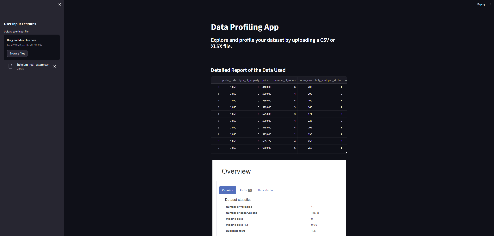

# Real Estate

## Overview

This project focuses on the analysis of real estate data in Belgium. The dataset used in this project is sourced from [Dataset Link](provide_link_here). The analysis involves data cleaning, exploration, and visualization using various Python libraries.

## Dataset

- **Source:** [Dataset Link](https://github.com/MDropsy/challenge-collecting-data)
- **Format:** CSV or XLSX

## Project Structure

The project is organized into the following components:

1. **Data Cleaning:**
   - Raw data is preprocessed using Pandas for effective analysis.

2. **Pandas Profiling:**
   - Utilizes Pandas Profiling for comprehensive data profiling.
   - Generates a detailed report on the dataset's structure, statistics, and visualizations.

3. **Streamlit Dashboard:**
   - Implements a Streamlit app for interactive data exploration.
   - Allows users to upload a CSV or XLSX file, view data, and explore profiling reports.

4. **EDA (Exploratory Data Analysis):**
   - Utilizes Matplotlib and Seaborn for in-depth data visualization.
   - Explores relationships, distributions, and trends within the dataset.

## Setup

1. Clone the repository:

    ```bash
    git clone https://github.com/thiphan94/Real-Estate.git
    ```

2. Install dependencies:

    ```bash
    pip install -r requirements.txt
    ```

## Running the Streamlit App

Execute the following command in your terminal to run the Streamlit app:

```bash
streamlit run app.py